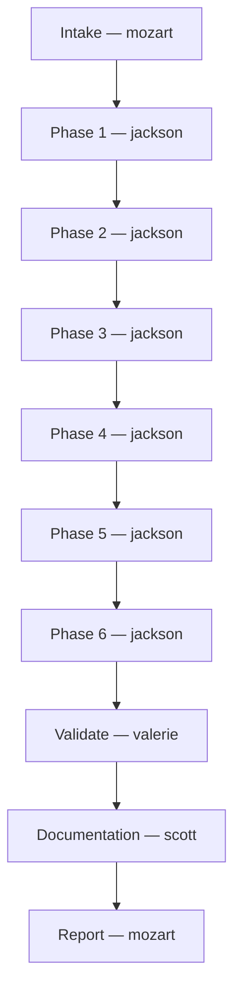

# Pipeline flow: core-converter

| Field | Value |
|---|---|
| Run started | 2026-05-03 |
| Run completed | 2026-05-03 |
| Shape | DELIVER |
| Tier | STANDARD |
| Flow | FULL (entered at Stage 7 — spec pre-approved) |
| Mode | AUTONOMOUS |
| Context | GREENFIELD |
| ticket | n/a |
| Plan | thoughts/shared/plans/core-converter.md |
| Investigation | n/a |

## Agent flow

## Stage trace

- **Stage 1 (Intake)**: mozart classified DELIVER / STANDARD / GREENFIELD / AUTONOMOUS. Entered at Stage 7 — spec pre-approved by mcp-orchestra pipeline. No ticketing configured.
- **Stage 7 (Implement, phase 1/6)**: jackson → committed `395be23` — pyproject.toml, package skeleton, 6 files. Gate clean.
- **Stage 7 (Implement, phase 2/6)**: jackson → `749e739` (red), `16de6cf` (green) — domain model, 31 tests. Gate clean.
- **Stage 7 (Implement, phase 3/6)**: jackson → `13614d4` (red), `31ae7ba` (green) — exchange rate registry, 46 tests. Gate clean.
- **Stage 7 (Implement, phase 4/6)**: jackson → `dc94001` (red), `962f594` (green) — converter engine, 63 tests. Gate clean.
- **Stage 7 (Implement, phase 5/6)**: jackson → `74cdc67` — integration test (Converter + Registry, no mocking), 70 tests. Gate clean.
- **Stage 7 (Implement, phase 6/6)**: jackson → `c74eb22` (red), `d20cdca` (green) — CLI entry point, 82 tests. Manual CLI verified. Gate clean.
- **Stage 10 (Validate)**: valerie FULL → **SIGNOFF** — 82/82 tests, all Gherkin scenarios covered, TDD commit order verified, no float math.
- **Stage 11 (Reconcile)**: valerie non-blocking note addressed — portable e2e CLI path, committed `c1e6496`.
- **Stage 12 (Documentation)**: scott → `efdc935` — README Usage section, CHANGELOG.md created, roadmap Done, PRD materials Complete.
- **Stage 13 (Report)**: mozart finalized.

## Agent participation summary

| Agent | Role this run | Invocations | Outcome |
|---|---|---|---|
| mozart | conductor, per-phase gate | 1 (continuous) | all 6 phases gated and committed |
| jackson | implementer | 6 phases | all committed, tests green |
| valerie | verifier | 1 (FULL) | SIGNOFF — 82/82 |
| scott | documenter | 1 | README, CHANGELOG, roadmap, PRD updated |

## Skipped agents (and why)

- **sarah**: entered at Stage 7 (spec pre-approved); no research needed
- **harry**: entered at Stage 7; plan derived from approved spec
- **bob**: entered at Stage 7; plan review skipped
- **librarian**: GREENFIELD — nothing to search against
- **xander**: no auth, secrets, or untrusted input surfaces
- **dexter**: no refactor or shared abstractions — new greenfield domain
- **ruby**: no UI/UX surface
- **otto**: no infra/k8s manifests
- **ian**: no public API changes, exported symbols, or schema modifications
- **dick**: not a bug-shaped task

## Notes

- Entered at Stage 7 because the mcp-orchestra pipeline had already approved the spec — stages 2–6 were replaced by that prior work
- GREENFIELD context: no librarian invocations at any stage
- No ticketing system configured in CLAUDE.md — ticket lifecycle fully skipped
- One minor fix post-valerie SIGNOFF: portable e2e test path (non-blocking, addressed as cleanup commit)
